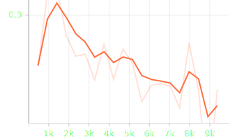
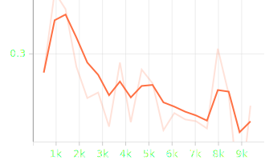
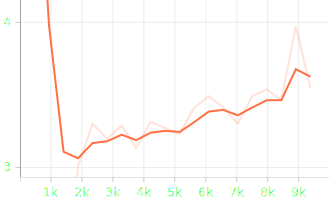
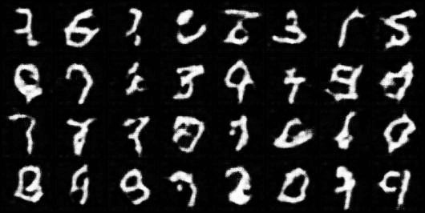
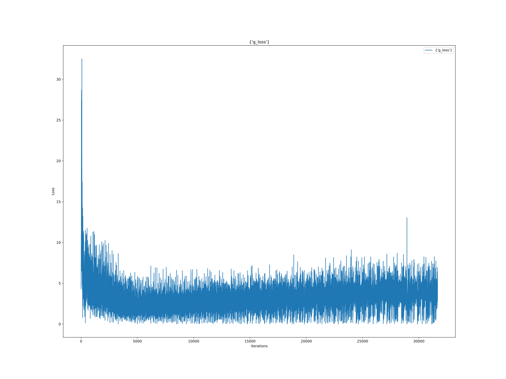
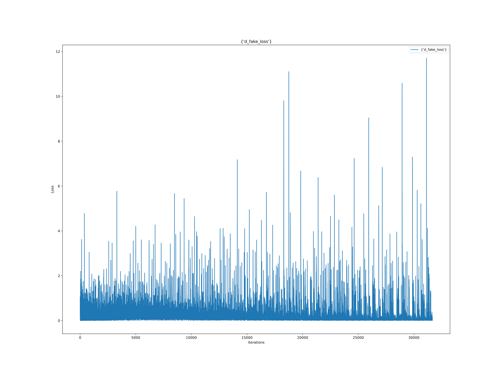
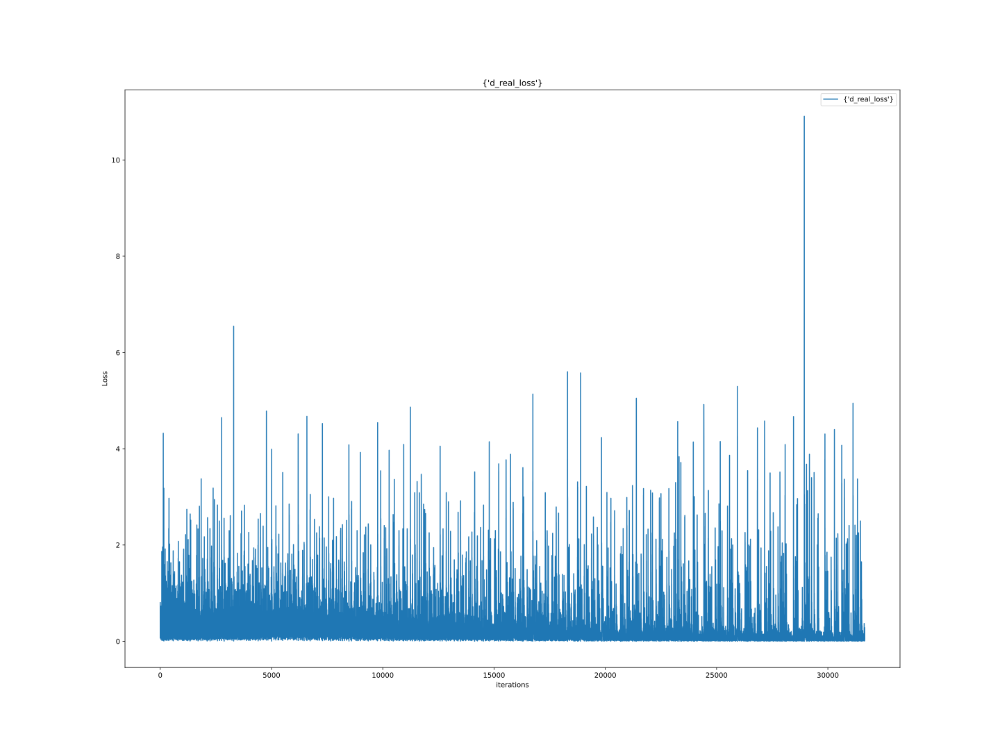
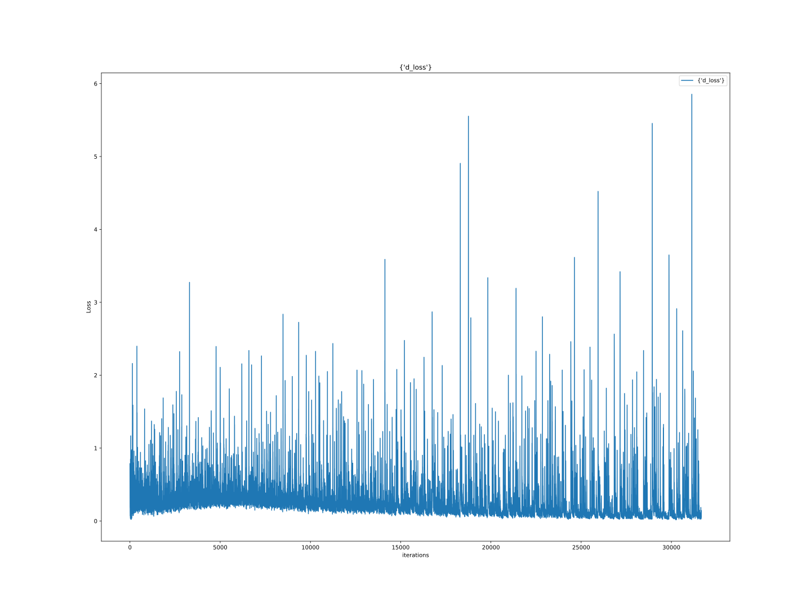
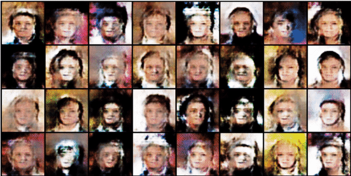

# GANS

## 1. GAN (Multilayer Perceptron)

## 2. DCGAN (Deep Convolutional)

| D(x)                                                                 | D(G(z)) | 1-D(G(z)) | (D(G(z)) + 1-D(G(z)))/2                | Result                                                                        |
|----------------------------------------------------------------------|------|-----------|----------------------------------------|-------------------------------------------------------------------------------|
|  |      |           |  |  |
|            |  |  |  |                      |

## 3. 